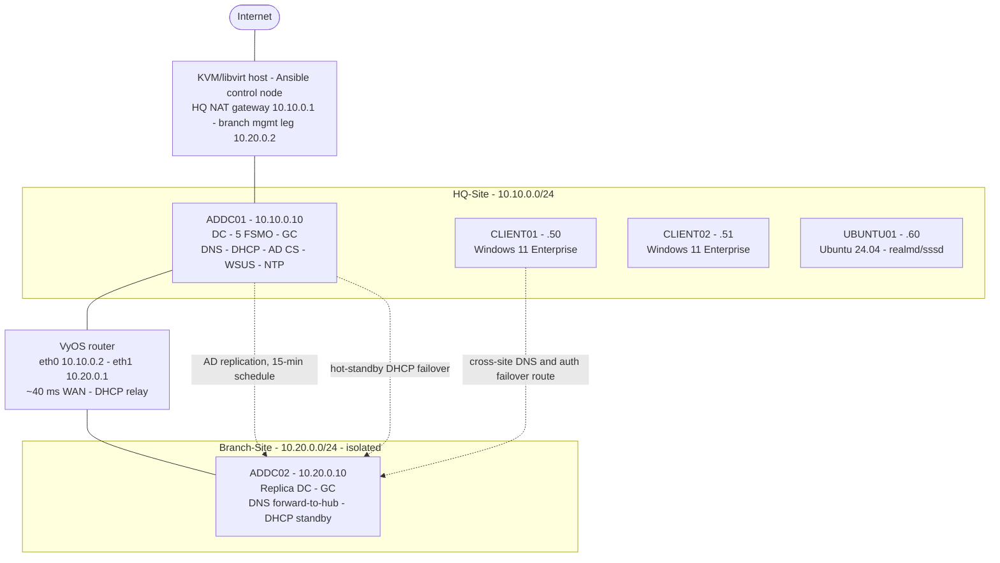
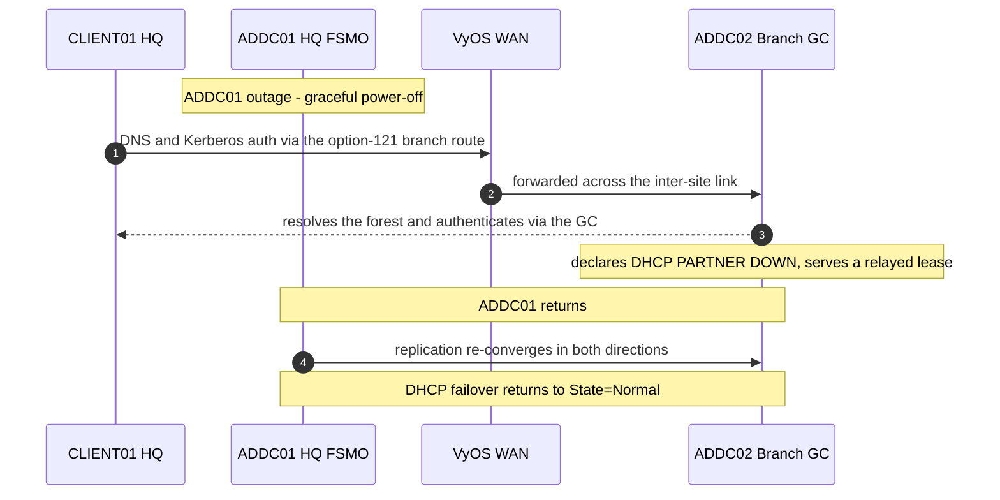

# windows-ad-ansible-kvm

**Ansible Infrastructure-as-Code for a production-quality, two-site Active Directory environment on KVM/libvirt — provisioned from bare ISOs and verified end to end.**

Active Directory is still the identity backbone of most enterprise and MSP environments, and what
separates operators from engineers is designing it for **resilience**, automating it so it's
**reproducible**, and **proving it recovers** when a controller fails. This project delivers a complete
two-site AD forest as Ansible Infrastructure-as-Code on a single Linux KVM/libvirt host — domain
controllers, DNS, DHCP, AD CS, WSUS, GPO baselines, Windows and Linux domain members, and a second
**isolated** branch site with cross-site replication and DHCP failover — provisioned from bare install
media and verified end to end. The control host is never modified by the automation — a hard safety
boundary enforced in the roles themselves.

---

## Architecture

The forest is **complete and verified end to end**: ~25 Ansible roles build it from bare install media
— idempotently (two-run gates), in about 60–75 minutes, mostly unattended — and an end-to-end smoke test
gates every component. Here is the shape, then how it comes together.



| VM | Role | OS | Site · IP |
|---|---|---|---|
| `ADDC01-corp` | Primary DC — AD DS, DNS, DHCP, AD CS (Enterprise Root CA), NTP, WSUS; **all 5 FSMO + GC** | Windows Server 2025 | HQ · `10.10.0.10` |
| `ADDC02-corp` | **Branch replica DC + GC**; branch DNS + DHCP (HQ-scope hot-standby) | Windows Server 2025 | Branch · `10.20.0.10` |
| `CLIENT01` / `CLIENT02` | Domain-joined workstations — real **vTPM 2.0**, machine-cert **autoenrollment** | Windows 11 Enterprise | HQ · `10.10.0.50` / `.51` |
| `UBUNTU01-corp` | Domain-joined Linux server — `realmd` + `sssd`, AD identity + sudo | Ubuntu 24.04 LTS | HQ · `10.10.0.60` |
| `VYOS01` | Inter-site router — routes HQ⇄Branch, DHCP relay, ~40 ms `netem` WAN | VyOS rolling (free OSS) | `10.10.0.2` / `10.20.0.1` |

Forest `corp.markandrewmarquez.com` (NetBIOS `CORP`) · HQ `10.10.0.0/24` (host gateway `.1`) ·
Branch `10.20.0.0/24` (isolated; VyOS gateway `.1`).

### How it comes together

**Born unattended.** Every machine starts from a per-VM install ISO — a Windows `Autounattend.xml` or a
Linux cloud-init seed — that boots, installs, and brings up WinRM or SSH with no one at the console. The
`kvm_windows_vm` and `kvm_linux_vm` roles define each libvirt domain (q35 + UEFI Secure Boot + TPM 2.0),
attach the media, and wait for the management channel to answer — about twelve minutes from cold boot to
a working desktop.


**Patched before it ever runs.** The Server 2025 media is DISM-slipstreamed (`kvm_iso_slipstream`) so the
controller boots already at build `26100.32860` — current on day one, with no post-install patch window.


**One controller, the services a real site needs.** `ad_dc` promotes ADDC01 into the forest
`corp.markandrewmarquez.com` — all five FSMO roles and a Global Catalog — then a named-admin role and
RID-500 hardening lock down the built-in Administrator. Focused roles layer the services on top:
AD-integrated DNS (`ad_dns`), DHCP with reservations (`ad_dhcp`), an Enterprise Root CA (`ad_cs`), a
Microsoft Security Compliance Toolkit GPO baseline (`ad_gpo`), authoritative time (`ad_ntp`), and WSUS
(`ad_wsus`).


**Endpoints that actually join.** Two Windows 11 Enterprise workstations join the domain with a real
vTPM 2.0 and pick up a machine certificate by **autoenrollment** from the CA (`domain_join_windows`) —
GPO-driven, with no manual request.


The *same* forest serves Linux: an Ubuntu 24.04 server joins through `realmd`/`sssd` (`domain_join_linux`),
resolving AD identities with `id` and honoring Domain Admins for `sudo`.


**A second site — not a second subnet on paper.** A genuinely isolated branch sits on its own
`10.20.0.0/24` network, reachable from HQ only through a VyOS router (`net_router_vyos`) that shapes a
~40 ms WAN. `ad_dc_replica` promotes ADDC02 as a replica DC + Global Catalog; `ad_sites` lays down AD
Sites & Services with a costed, scheduled site link; and self-first DNS plus reciprocal hot-standby DHCP
failover let the branch ride out a WAN cut — or the loss of HQ entirely, which is what the
[disaster-recovery drills](#disaster-recovery) below put to the test.

---

## Disaster recovery

Multi-site redundancy is only real if it survives the failure it's designed for — so that failure is
**rehearsed**, not assumed. Two complementary drills, backed by a documented FSMO-seizure runbook:

- a **live, non-destructive failover drill** that gracefully powers off the live HQ DC and proves the
  branch DC carries authentication, DNS, and DHCP, then recovers and re-converges, and
- an **isolated-sandbox FSMO-seize rehearsal** that clones the branch DC into an isolated network and
  *actually* seizes all five FSMO roles — the only safe way to execute a real seizure, since a
  seized-from DC must never rejoin the domain.

The sequence below is the live failover drill, end to end:



Cross-site failover depends on HQ clients being able to *reach* the branch DC across the link. Because
the branch network is isolated and HQ clients' gateway is the host, the branch route is delivered to
every HQ client centrally via **DHCP option 121** (classless static routes) — chosen over the legacy
option 249 for Windows 11 24H2 option-type safety, with the default route encoded per RFC 3442 so
clients keep internet, and replicated to the standby DHCP server. The result below is CLIENT01 with the
branch route installed — reaching the branch DC across the inter-site link and resolving the forest via
it: the path that carries DNS and authentication when the HQ DC is offline.


---

## What this demonstrates

**Active Directory, in depth.** Multi-site design (Sites/Subnets/site-links, with the replication
schedule honored — proven by an object round-trip, not assumed), replication topology, FSMO + Global
Catalog, AD-integrated DNS, AD CS with machine-certificate autoenrollment, GPO baselines (Microsoft
Security Compliance Toolkit), and WSUS.

**Networking.** Subnetting and an explicit IP plan, inter-site routing on VyOS, WAN-latency simulation
(`netem`), and DHCP end to end — scopes, exclusions, MAC reservations, **hot-standby failover**,
cross-site **relay**, and **classless static routes (option 121)** — alongside self-first / local-first
DNS resilience for a WAN-separated, one-DC-per-site topology.

**IaC & automation.** ~25 Ansible roles and playbooks with strict idempotency (two-run gates), Windows
configuration via inline `win_powershell` where no native module exists, `ansible-vault` from day one, a
`site.yml` orchestrator with fail-fast (`any_errors_fatal`), and CI guardrails (`ansible-lint` +
`gitleaks`).

**Virtualization.** KVM/libvirt with q35 / UEFI Secure Boot / TPM 2.0, unattended Windows Server 2025
and Windows 11 installs from slipstreamed media, and snapshot / backup / fire-drill / teardown tooling.

---

## Project structure

```
windows-ad-ansible-kvm/
├── ansible/
│   ├── ansible.cfg                 # inventory, vault, and connection defaults
│   ├── requirements.yml            # collections: microsoft.ad, ansible.windows, community.{windows,libvirt}, vyos.vyos, ...
│   ├── inventory/
│   │   ├── lab.yml                 # the fleet
│   │   └── group_vars/             # all/ (+ vault), dc, dc_replica, clients, linux_clients, routers, windows
│   ├── playbooks/                  # NN-verb-noun.yml, ordered for full builds
│   │   ├── site.yml                # one-command orchestrator (00 -> 99) with fail-fast
│   │   ├── 00..08-*.yml            # base build: network -> DC -> services -> clients -> linux -> join
│   │   ├── 09..18-*.yml            # multi-site: AD sites, ADDC02 replica, VyOS, DNS cross-point, branch DHCP + failover + relay
│   │   ├── verify-multisite*.yml   # read-only two-site health + schedule round-trip proof
│   │   ├── dr-failover-drill.yml   # live, non-destructive DR drill
│   │   ├── snapshot.yml · backup-ad.yml · fire-drill.yml · teardown.yml   # operations
│   │   └── 99-smoke-test.yml       # end-to-end verification gate
│   ├── roles/                      # 23 roles, grouped by purpose:
│   │   ├── kvm_network · kvm_windows_vm · kvm_linux_vm · kvm_iso_slipstream         # provisioning: libvirt, VMs, ISO slipstream
│   │   ├── ad_dc · ad_admins · ad_harden_builtin_admin · ad_dns · ad_dhcp · ad_ntp  # core DC + directory services
│   │   ├── ad_cs · ad_gpo · ad_wsus                                                 # PKI, GPO baseline, updates
│   │   ├── ad_sites · ad_dc_replica · net_router_vyos                               # multi-site: sites, branch replica, router
│   │   ├── domain_join_windows · domain_join_linux                                  # endpoint domain join
│   │   ├── ops_backup · ops_snapshot · ops_firedrill · ops_teardown                 # operations + DR tooling
│   │   └── _common                                                                  # shared defaults / handlers
│   └── files/                      # templates, GPO baseline backups, seed assets
├── docs/
│   ├── screenshots/                # provisioning milestones (shown above)
│   └── assets/                     # architecture + cross-site failover proof images
├── .github/                        # CI: gitleaks secret scan
├── .pre-commit-config.yaml         # gitleaks pre-commit hook
├── .gitleaks.toml
├── LICENSE
└── README.md
```

---

## License

Proprietary — all rights reserved. See [LICENSE](LICENSE). Source-available for review; no use, copying, modification, or redistribution without prior written permission.
