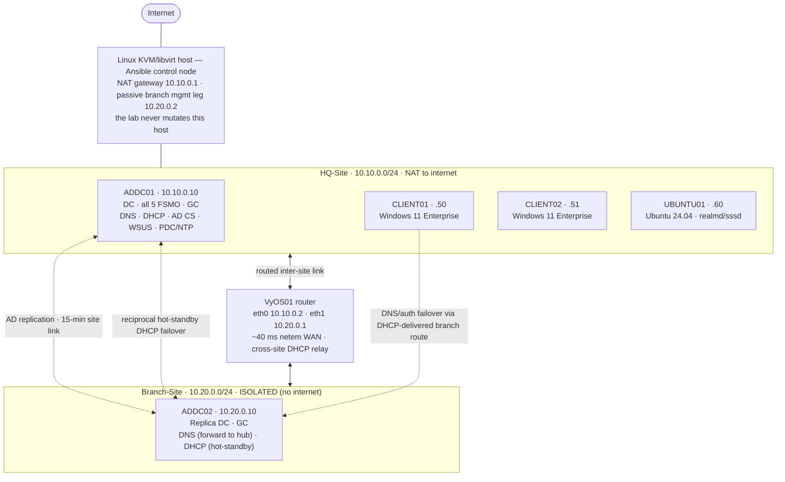
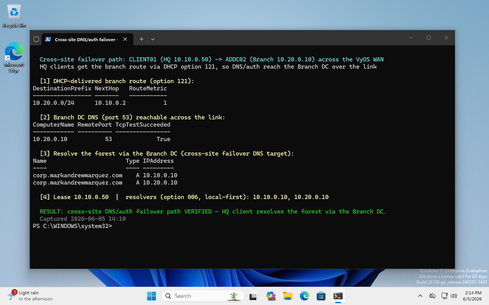

# windows-ad-ansible-kvm

**Ansible Infrastructure-as-Code for a production-quality, two-site Active Directory lab on KVM/libvirt — built from bare ISOs, and drilled until disaster recovery actually works.**

Active Directory is still the identity backbone of most enterprise and MSP environments, and the
skills that separate operators from engineers are designing it for **resilience**, automating it so
it's **reproducible**, and **proving it recovers** when a controller fails. This project builds a
complete two-site AD forest entirely as Ansible IaC on a single Linux KVM/libvirt host — domain
controllers, DNS, DHCP, AD CS, WSUS, GPO baselines, Windows + Linux domain members, and a second
**isolated** branch site with cross-site replication and DHCP failover — then drills the
disaster-recovery path until it genuinely survives losing a domain controller. One hard rule
throughout: the lab **never mutates its control host** (a daily-driver PC).

What makes it more than a build script: the disaster-recovery path is **drilled, not assumed**. The
live HQ domain controller is gracefully powered off and the branch site is proven to carry
authentication, DNS, and DHCP on its own — then recover and re-converge cleanly. See
[Disaster recovery, drilled](#disaster-recovery-drilled).

---

## Architecture at a glance

From bare install media, ~25 Ansible roles provision a Windows Server 2025 domain controller (AD DS,
DNS, DHCP, AD CS, WSUS, NTP), two Windows 11 Enterprise clients, an Ubuntu 24.04 member server, a
**second replica DC in an isolated branch site**, and a **VyOS router** that joins the two sites over
a latency-shaped WAN link. Everything runs on q35 + OVMF UEFI Secure Boot + TPM 2.0; Windows installs
are unattended from slipstreamed media; the Linux host doubles as the Ansible control node and is, by
hard rule, never touched by the lab.



| VM | Role | OS | Site · IP |
|---|---|---|---|
| `ADDC01-corp` | Primary DC — AD DS, DNS, DHCP, AD CS (Enterprise Root CA), NTP, WSUS; **all 5 FSMO + GC** | Windows Server 2025 | HQ · `10.10.0.10` |
| `ADDC02-corp` | **Branch replica DC + GC**; branch DNS + DHCP (HQ-scope hot-standby) | Windows Server 2025 | Branch · `10.20.0.10` |
| `CLIENT01` / `CLIENT02` | Domain-joined workstations — real **vTPM 2.0**, machine-cert **autoenrollment** | Windows 11 Enterprise | HQ · `10.10.0.50` / `.51` |
| `UBUNTU01-corp` | Domain-joined Linux server — `realmd` + `sssd`, AD identity + sudo | Ubuntu 24.04 LTS | HQ · `10.10.0.60` |
| `VYOS01` | Inter-site router — routes HQ⇄Branch, DHCP relay, ~40 ms `netem` WAN | VyOS rolling (free OSS) | `10.10.0.2` / `10.20.0.1` |

Forest `corp.markandrewmarquez.com` (NetBIOS `CORP`) · HQ `10.10.0.0/24` (host gateway `.1`) ·
Branch `10.20.0.0/24` (isolated; VyOS gateway `.1`). The whole fleet builds **and verifies**
end-to-end — idempotently (two-run gates), in ~60–75 minutes, mostly unattended — across AD, DNS,
DHCP, AD CS (including machine-certificate autoenrollment), NTP, WSUS, Windows domain membership, and
Linux realm membership.

## Disaster recovery, drilled

Multi-site redundancy is only real if it survives the failure it's designed for — so the lab
**rehearses** that failure rather than asserting it. Two complementary drills, backed by a documented
FSMO-seizure runbook:

- a **live, non-destructive failover drill** that gracefully powers off the live HQ DC and proves the
  branch DC carries authentication, DNS, and DHCP (then recovers and re-converges), and
- an **isolated-sandbox FSMO-seize rehearsal** that clones the branch DC into a `<forward>`-less
  network and *actually* seizes all five FSMO roles — the only safe way to execute a real seizure,
  since a seized-from DC must never rejoin the domain.

The sequence below is the live failover drill, end to end:

```mermaid
sequenceDiagram
    autonumber
    participant C1 as CLIENT01 (HQ)
    participant A1 as ADDC01 (HQ · all FSMO)
    participant V as VyOS WAN (~40 ms)
    participant A2 as ADDC02 (Branch · GC)
    Note over A1: ADDC01 outage — graceful power-off (drill; snapshot-insured)
    C1->>V: DNS query + Kerberos auth, routed via the option-121 branch route
    V->>A2: forwarded across the inter-site link
    A2-->>C1: resolves corp.* and authenticates (GC logon) — failover works
    Note over A2: declares DHCP PARTNER DOWN · serves a relayed cross-link lease
    Note over A1,A2: ADDC01 returns
    A1->>A2: replication re-converges both directions (5 inbound OK each)
    Note over A1,A2: DHCP failover auto-returns to State=Normal
```

Cross-site failover depends on HQ clients being able to *reach* the branch DC across the link. Because
the branch network is isolated and HQ clients' gateway is the host, the lab delivers the branch route
to every HQ client centrally via **DHCP option 121** (classless static routes) — chosen over the
legacy option 249 for Windows 11 24H2 option-type safety, with the default route encoded per RFC 3442
so clients keep internet, and scoped so it rides DHCP-failover replication to the standby. The result
below is CLIENT01 with the branch route installed — reaching the branch DC across the inter-site link
and resolving the forest via it: the path that carries DNS and authentication when the HQ DC is
offline.



## What this demonstrates

**Active Directory, in depth.** Multi-site design (Sites/Subnets/site-links, with the replication
schedule honored — proven by an object round-trip, not assumed), replication topology, FSMO + Global
Catalog, AD-integrated DNS, AD CS with machine-certificate autoenrollment, GPO baselines (Microsoft
Security Compliance Toolkit), and WSUS. **DR:** a documented FSMO-seizure runbook plus *two*
rehearsals — an isolated-clone seizure and a live, non-destructive failover.

**Networking.** Subnetting and an explicit IP plan, inter-site routing on VyOS, WAN-latency
simulation (`netem`), and DHCP end-to-end — scopes, exclusions, MAC reservations, **hot-standby
failover**, cross-site **relay**, and **classless static routes (option 121)** — alongside
self-first / local-first DNS resilience for a WAN-separated, one-DC-per-site topology.

**IaC & automation.** ~25 Ansible roles and playbooks with strict idempotency (two-run gates),
Windows configuration via inline `win_powershell` where no native module exists, `ansible-vault`
from day one, a `site.yml` orchestrator with fail-fast (`any_errors_fatal`), and CI guardrails
(`ansible-lint` + `gitleaks`).

**Virtualization.** KVM/libvirt with q35 / UEFI Secure Boot / TPM 2.0, unattended Windows Server
2025 and Windows 11 installs from slipstreamed media, and snapshot / backup / fire-drill / teardown
tooling.

**Production judgment.** ADR-driven decisions (58 ADRs), a hard **host-safety discipline** (the lab
never mutates its control host — guards baked into the riskiest roles), and production-correct
resilience choices throughout — hot-standby (not load-balance) DHCP failover for a WAN-separated
partner, self-first DNS for a one-DC-per-site topology, and option-121 (not legacy 249) classless
static routes for 24H2-safe cross-site routing.

---

## License

Proprietary — all rights reserved. See [LICENSE](LICENSE). Source-available for review; no use, copying, modification, or redistribution without prior written permission.
