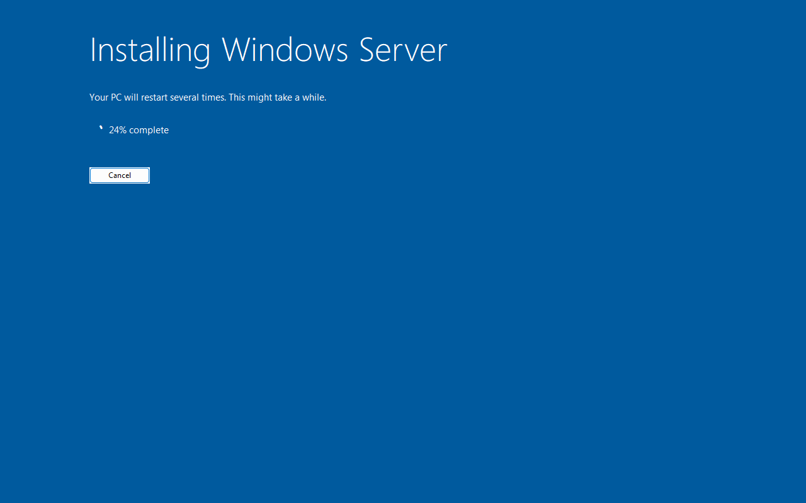
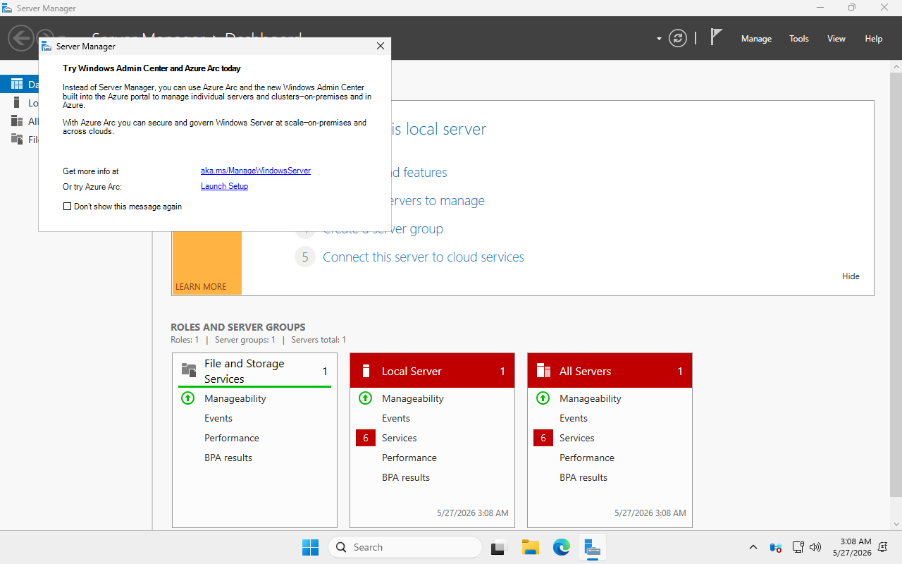

# windows-ad-ansible-kvm

**Ansible Infrastructure-as-Code for a production-quality MSP-style Active Directory lab on KVM/libvirt.**

End-to-end automated build: from a bare Ubuntu 24.04 host, Ansible provisions a Windows Server 2025 Domain Controller (with AD DS, DNS, DHCP, AD CS, NTP, WSUS), two Windows 11 Enterprise clients, and an Ubuntu 24.04 member server — all joined to a single forest, on an isolated `10.10.0.0/24` network.

> **Predecessor:** [marky224/Active-Directory-Domain-Controller-Provisioning](https://github.com/marky224/Active-Directory-Domain-Controller-Provisioning) — the original PowerShell-imperative version. Frozen, not under active development. This repo replaces it with an IaC-first Ansible approach.

---

## Status

**Milestone 2 complete (2026-05-27)** — `kvm_windows_vm` role provisions a Windows Server 2025 24H2 VM from bare metal to a reachable WinRM HTTPS endpoint in ~12 minutes. Fully deterministic, no manual intervention.

| Milestone | Status | What it produces |
|---|---|---|
| 1 — libvirt network | ✅ Done | `corp-lab` libvirt network, 10.10.0.0/24, no DHCP (DC owns it) |
| 2 — Windows VM provisioner | ✅ Done | `kvm_windows_vm` role → Server 2025 VM, autologon, WinRM HTTPS:5986 reachable |
| 3 — DC promotion + AD config | 🚧 Next | `ad_dc`, `ad_dns`, `ad_dhcp`, `ad_cs`, `ad_gpo`, `ad_ntp`, `ad_wsus` |
| 4 — Client provisioning + domain join | ⏳ Planned | Win 11 + Ubuntu joined to `corp.markandrewmarquez.com` |
| 5 — Smoke test + backups | ⏳ Planned | End-to-end verification + nightly state backup |

### Milestone 2 visual progression

| Stage | Screenshot |
|---|---|
| WinPE setup launching after CD-eject + cold-restart hand-off |  |
| Install in progress (early phase) |  |
| Install in progress (late phase) |  |
| OOBE auto-skipped → autologon → desktop |  |
| Server Manager up, WinRM HTTPS:5986 reachable from host |  |

Validation: `ansible.windows.win_ping` → `pong` against `ADDC01-corp` at `10.10.0.10:5986`.

---

## What you get

| VM | OS | Role |
|---|---|---|
| `ADDC01-corp` | Windows Server 2025 Std + Desktop Experience | Domain Controller — AD DS, DNS, DHCP, AD CS (Enterprise Root CA), NTP, WSUS |
| `CLIENT01-corp` | Windows 11 Enterprise | Domain-joined workstation |
| `CLIENT02-corp` | Windows 11 Enterprise | Domain-joined workstation |
| `UBUNTU01-corp` | Ubuntu 24.04 LTS Server | Domain-joined Linux server (realmd + sssd) |

- **Forest:** `corp.markandrewmarquez.com` (NetBIOS: `CORP`)
- **Subnet:** `10.10.0.0/24` — DC owns DHCP (scope `.100-.199`) with MAC-tied reservations for clients
- **GPO baseline:** Microsoft Security Compliance Toolkit Server 2025 baseline + 12 lab-specific overrides
- **AD state backup:** nightly `wbadmin systemstatebackup` to a host-side Samba share + `Backup-GPO`/`Backup-CARoleService`/`Export-DhcpServer` exports via WinRM `fetch`
- **Snapshots:** automatic at each provisioning phase (`vm-built`, `ad-promoted`, `roles-installed`, `clients-joined`, `linux-joined`)
- **Fire drill:** quarterly playbook restores the latest backup to a sandbox VM on an isolated network and runs the smoke test against it

Total wall-clock for a clean provision: **~60–75 minutes**, mostly unattended.

---

## Why Milestone 2 was hard (a brief tour of the windlp jungle)

Server 2025's "windlp" installer (the 24H2 redesigned setup pipeline) breaks several decade-old patterns that Packer/Vagrant/dockur templates rely on. Getting `kvm_windows_vm` to a deterministic green run required stacking five distinct fixes:

1. **virtio-win #1100 workaround** — install CD must be on SATA bus, not virtio-scsi (else WinPE driver loading retriggers a known virtio-win bug → Autounattend never discovered).
2. **Per-VM custom install ISO** — 24H2 windlp does not scan separate removable media for `Autounattend.xml`; it must be at the root of the install ISO itself. `xorriso` re-masters the install ISO per VM, also swapping `BOOTX64.EFI` for `cdboot_noprompt.efi` to bypass the "Press any key to boot from CD" prompt.
3. **Pre-enrolled OVMF NVRAM BootOrder** — Ubuntu's OVMF won't auto-add removable-media boot entries on fresh NVRAM; without pre-enrollment via `virt-fw-vars --append-boot-filepath`, the VM drops to UEFI Interactive Shell.
4. **Post-WinPE CD eject + forced cold restart** — Setup's queued reboot lands back on the CD by default (firmware priority + Autounattend's `WillWipeDisk=true` re-wipes the ESP each cycle → infinite WinPE loop). The role watches the SPICE screen for the install-progress UI → blank-screen transition (= WinPE committed `bcdboot`), then `virsh change-media --eject --live --config` + explicit `destroy` + `start` to force OVMF to re-enumerate devices and boot the disk's freshly-written Windows Boot Manager.
5. **bootstrap.ps1 hardening** — Windows PowerShell 5.1 reads BOM-less scripts as CP1252, so a single em-dash from a markdown copy-paste silently breaks parsing → script never runs → no WinRM listener. The role lints the rendered `.ps1` for non-ASCII bytes at template time. Bootstrap also forces network profile to Private as line 1 (defense against the documented Server 2025 NLA-classifies-as-Public regression where Domain/Private-scoped firewall rules silently disable a few minutes after first logon).

The handoff document in `_private/handoff/` captures the full saga.

---

## Hardware requirements

- x86_64 with VT-x or AMD-V enabled in BIOS
- 20 GB free RAM (32 GB recommended)
- 250 GB free disk (400 GB recommended)
- Ubuntu 24.04 LTS host (other Debian-family distros should work; package names may differ)

---

## Quickstart

> Full step-by-step in the [Prerequisites](docs/PREREQUISITES.md) and [Runbook](docs/RUNBOOK.md). The summary below is the happy path.

### 1. Install host packages

```bash
sudo apt update && sudo apt install -y \
  qemu-kvm libvirt-daemon-system libvirt-clients virtinst bridge-utils \
  xorriso ansible-core \
  python3-libvirt python3-lxml python3-winrm python3-pip \
  swtpm swtpm-tools ovmf \
  virt-manager virt-viewer \
  samba samba-common-bin libnss-libvirt wimtools pipx python3-virt-firmware

sudo usermod -aG libvirt,kvm "$USER"
sudo systemctl enable --now libvirtd
# Log out and back in for group changes to take effect.
```

### 2. Get ISOs

```bash
mkdir -p /home/$USER/vm-lab/{disks,iso,seed-iso,backups,snapshots}
cd /home/$USER/vm-lab/iso

# virtio-win 0.1.271 (PINNED — do NOT use 0.1.285)
curl -sSL -O https://fedorapeople.org/groups/virt/virtio-win/direct-downloads/archive-virtio/virtio-win-0.1.271-1/virtio-win-0.1.271.iso
ln -sf virtio-win-0.1.271.iso virtio-win.iso

# Ubuntu 24.04 cloud image
curl -sSL -O https://cloud-images.ubuntu.com/noble/current/noble-server-cloudimg-amd64.img
```

Plus, downloaded manually through Microsoft eval forms (no credit card, no product key):
- **Windows Server 2025**: https://www.microsoft.com/en-us/evalcenter/evaluate-windows-server-2025 → save as `WindowsServer2025.iso`
- **Windows 11 Enterprise**: https://www.microsoft.com/en-us/evalcenter/evaluate-windows-11-enterprise → save as `Windows11Enterprise.iso`

### 3. Vault password + secrets

```bash
openssl rand -base64 32 > ~/.ansible-vault-pass-corp-lab
chmod 600 ~/.ansible-vault-pass-corp-lab
# Back up the contents to your password manager NOW. If you lose it, the vault is unrecoverable.
```

### 4. Install Ansible collections

```bash
ansible-galaxy collection install -r ansible/requirements.yml
```

### 5. Set secrets

```bash
ansible-vault edit ansible/group_vars/all/vault.yml
# Set: vault_local_admin_password, vault_dsrm_password, vault_domain_admin_password,
#      vault_ca_passphrase, vault_dcbackup_smb_password
```

### 6. Run the lab

```bash
cd ansible
ansible-playbook playbooks/00-libvirt-network.yml         # ✅ Milestone 1
ansible-playbook playbooks/01-provision-dc.yml            # ✅ Milestone 2
ansible-playbook playbooks/02-configure-dc.yml            # 🚧 Milestone 3 (in progress)
ansible-playbook playbooks/03-provision-clients.yml       # ⏳
ansible-playbook playbooks/04-join-domain.yml             # ⏳
ansible-playbook playbooks/05-provision-linux.yml         # ⏳
ansible-playbook playbooks/06-join-linux.yml              # ⏳
ansible-playbook playbooks/99-smoke-test.yml              # ⏳
```

Or all in one (once Milestone 3+ ships):
```bash
ansible-playbook playbooks/site.yml
```

---

## Architecture

- **Single mental model:** Ansible roles + playbooks. No standalone PowerShell scripts. Where Windows config has no native Ansible module (DNS server, DHCP, WSUS, GPO), the role uses inline `ansible.windows.win_powershell` blocks within YAML tasks.
- **Hypervisor:** KVM/libvirt with `community.libvirt`. Each VM defined via `virt-install` with q35 + OVMF UEFI + Secure Boot + swtpm TPM 2.0.
- **Windows install:** per-VM custom install ISO (xorriso re-masters the Server 2025 ISO with `Autounattend.xml` at root and `cdboot_noprompt.efi` swapped in for the El Torito boot file). Bootstrap PowerShell runs from a separate seed ISO via Autounattend's `<FirstLogonCommands>`.
- **Linux install:** cloud-init NoCloud datasource (also per-VM seed ISO).
- **Authentication:** `ansible-vault` from day one — vault password file at `~/.ansible-vault-pass-corp-lab` (never committed).

## Roles

| Role | Purpose | Status |
|---|---|---|
| `kvm_network` | Define + start `corp-lab` libvirt network (10.10.0.0/24, NAT, no DHCP) | ✅ |
| `kvm_windows_vm` | Generic Windows VM provisioning (custom install ISO, libvirt domain, post-WinPE CD-eject + cold-restart, WinRM HTTPS bootstrap) | ✅ |
| `kvm_linux_vm` | Generic Linux VM provisioning (cloud-init seed, boot, wait for SSH) | 🚧 |
| `ad_dc` | Static IP, AD DS install, forest creation (`microsoft.ad.domain`) | 🚧 |
| `ad_dns` | DNS forwarders, reverse zone | ⏳ |
| `ad_dhcp` | DHCP scope + MAC-tied reservations for known clients | ⏳ |
| `ad_cs` | Enterprise Root CA install + `cs_authority` + `cs_template` | ⏳ |
| `ad_gpo` | Import MSFT SCT Server 2025 baseline + 12 lab-specific overrides | ⏳ |
| `ad_ntp` | PDC NTP authority configuration | ⏳ |
| `ad_wsus` | WSUS install + async sync trigger | ⏳ |
| `domain_join_windows` | Win 11 client domain join (`microsoft.ad.membership`) | ⏳ |
| `domain_join_linux` | Ubuntu domain join via `realmd` + `sssd` | ⏳ |
| `ops_backup` | AD state backup orchestration (SMB to host + WinRM `fetch`) | ⏳ |

## Playbooks

`00-libvirt-network.yml`, `01-provision-dc.yml`, `02-configure-dc.yml`, `03-provision-clients.yml`, `04-join-domain.yml`, `05-provision-linux.yml`, `06-join-linux.yml`, `99-smoke-test.yml`, plus operational utilities: `snapshot.yml`, `rollback.yml`, `list-snapshots.yml`, `backup-ad.yml`, `fire-drill.yml`, `teardown.yml`.

---

## License

MIT. See [LICENSE](LICENSE).
