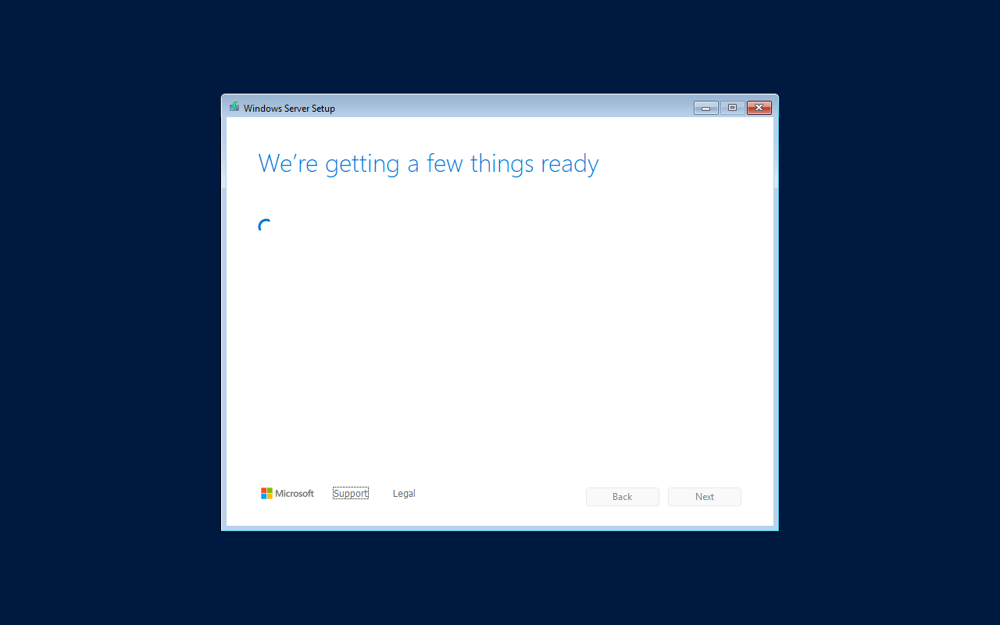
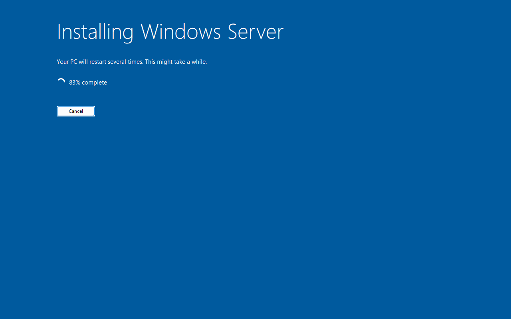
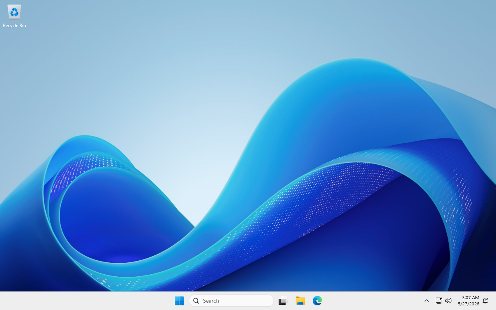
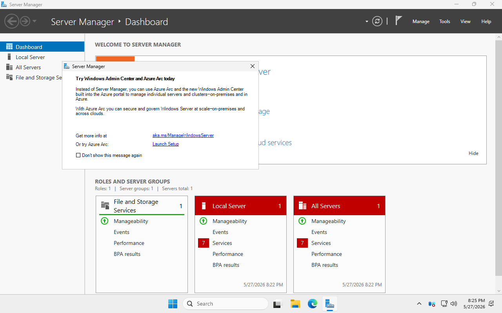
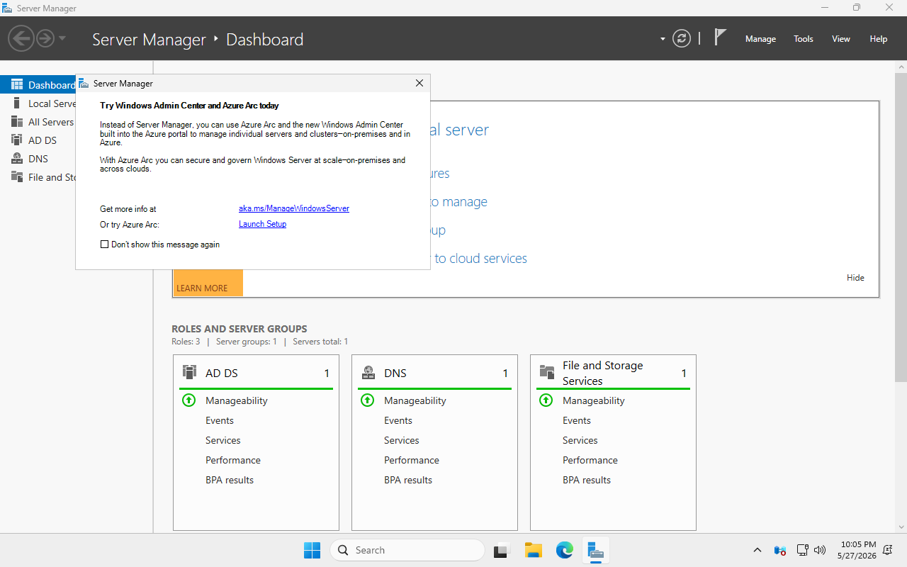
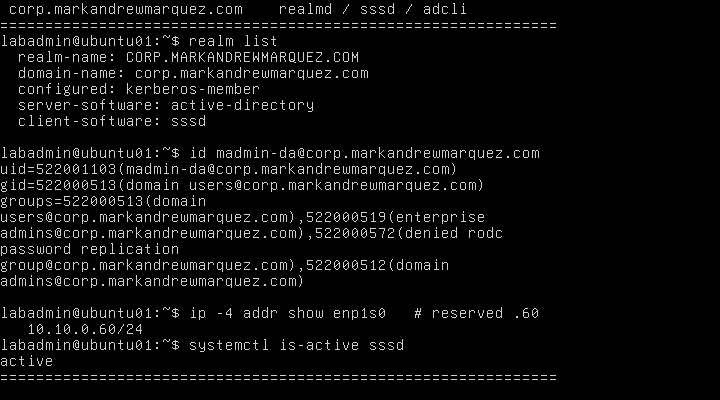

# windows-ad-ansible-kvm

**Ansible Infrastructure-as-Code for a production-quality MSP-style Active Directory lab on KVM/libvirt.**

End-to-end automated build: from a bare Ubuntu 24.04 host, Ansible provisions a Windows Server 2025 Domain Controller (with AD DS, DNS, DHCP, AD CS, NTP, WSUS), two Windows 11 Enterprise clients, and an Ubuntu 24.04 member server — all joined to a single forest, on an isolated `10.10.0.0/24` network.

> **Predecessor:** [marky224/Active-Directory-Domain-Controller-Provisioning](https://github.com/marky224/Active-Directory-Domain-Controller-Provisioning) — the original PowerShell-imperative version. Frozen, not under active development. This repo replaces it with an IaC-first Ansible approach.

---

## Status

**Milestones 1–7 complete; Phase 6 (multi-site) in progress.** The full fleet is built and validated end-to-end (Milestone 6, 2026-05-30). Both Windows 11 clients are domain-joined (real vTPM 2.0) with machine-certificate **autoenrollment** from the Enterprise CA, and the Ubuntu 24.04 client is domain-joined via `realmd`/`sssd` (AD identity + Domain Admins sudo working). Getting the Linux client on the wire required two production-grade fixes: a MAC-based DHCP client-identifier (`dhcp-identifier: mac`) so the DC's MAC-keyed reservation binds it to `10.10.0.60`, and Kerberos principal canonicalization (`canonicalize`/`krb5_canonicalize`) for the Server 2025 KDC. `99-smoke-test.yml` now passes across the whole fleet — AD, DNS, DHCP, CA trust (incl. CA-cert fetch from Linux), NTP, Windows domain membership + machine certs, and Linux realm membership + AD identity + sudo.

| Milestone | Status | What it produces |
|---|---|---|
| 1 — libvirt network | ✅ Done | `corp-lab` libvirt network, 10.10.0.0/24, no DHCP (DC owns it) |
| 2 — Windows VM provisioner | ✅ Done | `kvm_windows_vm` role → Server 2025 VM, autologon, WinRM HTTPS:5986 reachable |
| 3 — DC promotion + named admin + RID 500 hardening | ✅ Done | `ad_dc` + `ad_admins` + `ad_harden_builtin_admin` → forest `corp.markandrewmarquez.com`, FSMO holder, `madmin-da` steady-state admin |
| 3.5 — DISM-slipstream Server 2025 install ISO | ✅ Done | `kvm_iso_slipstream` role → patched install media at build 26100.32860 |
| 4 — DC-resident services (DNS / DHCP / NTP) | ✅ Done | `ad_dns` + `ad_dhcp` + `ad_ntp` → forwarders, reverse zone, scope with reservations, authoritative time |
| 5 — Cert services + GPO baseline + WSUS | ✅ Done | `ad_cs` (Enterprise Root CA + Web Enrollment + 5 templates), `ad_gpo` (SCT v2602 baseline + Lab Delta), `ad_wsus` (D:\WSUS + 4 products + Default Approval Rule) |
| 6 — Client provisioning + domain join | ✅ Done | Win 11 clients built (real vTPM 2.0, 4 vCPU/8 GB) and **domain-joined** into `OU=Workstations` with **machine-cert autoenrollment** (Client-Auth cert from the Enterprise CA via the `Corp Workstation Authentication` template); Ubuntu 24.04 **domain-joined** via `realmd`/`sssd` (MAC-based DHCP reservation + Server 2025 Kerberos canonicalize fix) |
| 7 — Ops tooling (backup / snapshot / fire-drill / teardown / `site.yml`) | ✅ Done | `ops_backup` (system-state + config exports), `ops_snapshot` trio, `ops_firedrill` (isolated restore drill), `ops_teardown`, and the `site.yml` orchestrator with `any_errors_fatal` fail-fast (ADR-046–050) |
| Phase 6 — Multi-site (2nd DC + AD sites) | 🚧 In progress | Design locked (ADR-052). **Done:** isolated Branch network (`corp-branch`, 10.20.0.0/24); AD Sites & Services (HQ-Site/Branch-Site, subnet objects, HQ-Branch link); the **VyOS inter-site router** (`VYOS01`) routing HQ↔Branch with a ~40 ms netem WAN-latency simulation (verified: ADDC01→ADDC02 40 ms @ TTL=127 = one hop); the **ADDC02** Branch-replica VM built on the isolated net and **promoted to a writable Branch-Site replica DC + Global Catalog** — replication verified green **both directions** across all 5 NCs (KB 825036 island rule satisfied), SYSVOL/DFSR synced, krbtgt AES-OK; and **DNS cross-pointing** — each DC's resolver set **self-first** (loopback) with the cross-site partner as alternate, the WAN-branch-correct refinement of KB 825036's co-located pattern (each site keeps resolving if the inter-site link drops; island-safe once replication is verified), confirmed no-island + replication-clean both directions; and **reciprocal hot-standby DHCP failover** — ADDC02 serves a Branch scope (`10.20.0.0/24`) directly, while each DC is the hot-standby partner for the *other* site's scope (Microsoft's "Symmetric Model": ADDC01 active for HQ + standby for Branch, ADDC02 the reverse; both relationships `State=Normal`, shared-secret-authenticated), fronted by a clock-skew/DNS/reachability **preflight gate** that guards DHCP failover's ±1-minute time-sync requirement; and **DHCP DNS-resilience** — each scope's option 006 made **local-first** (both DCs, local preferred) and **self-healed to the hot-standby copy** (`ad_dhcp/tasks/replicate.yml`) so a client leased by the standby during a failover still gets a live resolver (ADR-056 amendment); and **multi-site verification** — a read-only, double-hop-safe health gate (`verify-multisite.yml`, run on **both** DCs) asserting replication, FSMO/GC placement, the `HQ-Branch` site-link spec (cost 100 / 15-min / change-notification off), subnet→site mappings, and both DHCP-failover relationships `State=Normal`, plus an opt-in round-trip proof (`verify-multisite-roundtrip.yml`) that the inter-site replication *schedule* is honored — a test object created on ADDC01 arrived on ADDC02 in **~7 minutes** (inside the 15-minute window), then was cleaned up. **Pending:** DR drill (FSMO seize), branch snapshots |

### From install ISO to a domain-joined fleet

| Stage | Screenshot |
|---|---|
| Unattended Server 2025 install begins (WinPE handoff via deterministic CD-eject + cold restart) |  |
| Install proceeds without intervention (~12 min wall-clock from cold boot to desktop) |  |
| OOBE auto-skipped → autologon → desktop; WinRM HTTPS:5986 listening |  |
| Patched Server 2025 build `26100.32860` — slipstreamed at install time via DISM, no post-install patching window |  |
| Forest `corp.markandrewmarquez.com` is live — ADDC01 holds all FSMOs, `madmin-da` named admin established, RID 500 hardened per Appendix D |  |
| `CLIENT01` — Windows 11 Enterprise client (real vTPM 2.0), domain-joined into `OU=Workstations` with machine-certificate autoenrollment from the Enterprise CA |  |
| `UBUNTU01` — Ubuntu 24.04 domain-joined via `realmd`/`sssd`: `realm list` shows `kerberos-member`, `id madmin-da@corp…` resolves the AD identity, on reserved `10.10.0.60` |  |

Validation: `ansible.windows.win_ping` → `pong` against `ADDC01-corp` at `10.10.0.10:5986` (and `ansible -m ping` against `UBUNTU01-corp`), authenticating as the steady-state named admin; `99-smoke-test.yml` passes across the whole fleet.

---

## What you get

| VM | OS | Role |
|---|---|---|
| `ADDC01-corp` | Windows Server 2025 Std + Desktop Experience | Domain Controller — AD DS, DNS, DHCP, AD CS (Enterprise Root CA), NTP, WSUS |
| `CLIENT01-corp` | Windows 11 Enterprise | Domain-joined workstation |
| `CLIENT02-corp` | Windows 11 Enterprise | Domain-joined workstation |
| `UBUNTU01-corp` | Ubuntu 24.04 LTS Server | Domain-joined Linux server (realmd + sssd) |

- **Forest:** `corp.markandrewmarquez.com` (NetBIOS: `CORP`)
- **Subnet:** `10.10.0.0/24` — DC owns DHCP (single scope `.50-.199`, exclusion `.50-.99` carves out the reservation block, dynamic pool `.100-.199`, MAC-tied reservations punch through the exclusion)
- **GPO baseline:** Microsoft Security Compliance Toolkit Server 2025 baseline + 12 lab-specific overrides
- **AD state backup:** `wbadmin systemstatebackup` (NTDS.dit + SYSVOL + AD CS) to a dedicated backup drive + `Backup-GPO`/`Backup-CARoleService`/`Export-DhcpServer`/`Export-DnsServerZone`/`csvde` exports zipped and fetched over WinRM
- **Snapshots:** automatic at each provisioning phase (`vm-built`, `ad-promoted`, `roles-installed`, `clients-joined`, `linux-joined`)
- **Fire drill:** `fire-drill.yml` restores the latest snapshot (or backup) into a throwaway DC on an **isolated** libvirt network, runs the DC smoke checks against it, and always tears the sandbox down — proving the backups/snapshots actually recover, without touching prod or the host

Total wall-clock for a clean provision: **~60–75 minutes**, mostly unattended.

---

## Hardware requirements

- x86_64 with VT-x or AMD-V enabled in BIOS
- 20 GB free RAM (32 GB recommended)
- 250 GB free disk (400 GB recommended)
- Ubuntu 24.04 LTS host (other Debian-family distros should work; package names may differ)

---

## Quickstart

> Full step-by-step in the [Prerequisites](docs/PREREQUISITES.md) and [Runbook](docs/RUNBOOK.md). The summary below is the happy path.

### 1. Install host packages

```bash
sudo apt update && sudo apt install -y \
  qemu-kvm libvirt-daemon-system libvirt-clients virtinst bridge-utils \
  xorriso ansible-core \
  python3-libvirt python3-lxml python3-winrm python3-pip \
  swtpm swtpm-tools ovmf \
  virt-manager virt-viewer \
  samba samba-common-bin libnss-libvirt wimtools pipx python3-virt-firmware

sudo usermod -aG libvirt,kvm "$USER"
sudo systemctl enable --now libvirtd
# Log out and back in for group changes to take effect.
```

### 2. Get ISOs

```bash
mkdir -p /home/$USER/vm-lab/{disks,iso,seed-iso,backups,snapshots}
cd /home/$USER/vm-lab/iso

# virtio-win 0.1.271 (PINNED — do NOT use 0.1.285)
curl -sSL -O https://fedorapeople.org/groups/virt/virtio-win/direct-downloads/archive-virtio/virtio-win-0.1.271-1/virtio-win-0.1.271.iso
ln -sf virtio-win-0.1.271.iso virtio-win.iso

# Ubuntu 24.04 cloud image
curl -sSL -O https://cloud-images.ubuntu.com/noble/current/noble-server-cloudimg-amd64.img
```

Plus, downloaded manually through Microsoft eval forms (no credit card, no product key):
- **Windows Server 2025**: https://www.microsoft.com/en-us/evalcenter/evaluate-windows-server-2025 → save as `WindowsServer2025.iso`
- **Windows 11 Enterprise**: https://www.microsoft.com/en-us/evalcenter/evaluate-windows-11-enterprise → save as `Windows11Enterprise.iso`

### 3. Vault password + secrets

```bash
openssl rand -base64 32 > ~/.ansible-vault-pass-corp-lab
chmod 600 ~/.ansible-vault-pass-corp-lab
# Back up the contents to your password manager NOW. If you lose it, the vault is unrecoverable.
```

### 4. Install Ansible collections

```bash
ansible-galaxy collection install -r ansible/requirements.yml
```

### 5. Set secrets

```bash
ansible-vault edit ansible/inventory/group_vars/all/vault.yml
# Set: vault_dc_admin_password   (built-in local Administrator at install; also
#                                  becomes built-in DOMAIN Administrator after dcpromo)
#      vault_safe_mode_password  (DSRM password, distinct from the above per ADR-031)
#      vault_named_admin_password (steady-state madmin-da identity post-promotion)
#      vault_ubuntu_initial_password (cloud-init seed for UBUNTU01-corp)
```

### 6. Run the lab

```bash
cd ansible
ansible-playbook playbooks/00-libvirt-network.yml         # ✅ Milestone 1
ansible-playbook playbooks/slipstream-iso.yml             # ✅ Milestone 3.5 (one-time per LCU wave)
ansible-playbook playbooks/01-provision-dc.yml            # ✅ Milestone 2
ansible-playbook playbooks/02-configure-dc.yml            # ✅ Milestone 3
ansible-playbook playbooks/03-configure-services.yml      # ✅ Milestone 4 (DNS/DHCP/NTP)
ansible-playbook playbooks/04-configure-services-advanced.yml  # ✅ Milestone 5 (CS/GPO/WSUS)
ansible-playbook playbooks/05-provision-clients.yml       # ✅ Milestone 6
ansible-playbook playbooks/06-join-domain.yml             # ✅ Milestone 6
ansible-playbook playbooks/07-provision-linux.yml         # ✅ Milestone 6
ansible-playbook playbooks/08-join-linux.yml              # ✅ Milestone 6
ansible-playbook playbooks/99-smoke-test.yml              # ✅ Milestone 6
```

Or build **and verify** the whole fleet in one command (runs `00 → 08`, then `99-smoke-test`; `--tags`/`--limit` scope partial runs):
```bash
ansible-playbook playbooks/site.yml
```

---

## Architecture

- **Single mental model:** Ansible roles + playbooks. No standalone PowerShell scripts. Where Windows config has no native Ansible module (DNS server, DHCP, WSUS, GPO), the role uses inline `ansible.windows.win_powershell` blocks within YAML tasks.
- **Hypervisor:** KVM/libvirt with `community.libvirt`. Each VM defined via `virt-install` with q35 + OVMF UEFI + Secure Boot + swtpm TPM 2.0.
- **Windows install:** per-VM custom install ISO (xorriso re-masters the Server 2025 ISO with `Autounattend.xml` at root and `cdboot_noprompt.efi` swapped in for the El Torito boot file). Bootstrap PowerShell runs from a separate seed ISO via Autounattend's `<FirstLogonCommands>`.
- **Linux install:** cloud-init NoCloud datasource (also per-VM seed ISO).
- **Authentication:** `ansible-vault` from day one — vault password file at `~/.ansible-vault-pass-corp-lab` (never committed).

## Roles

| Role | Purpose | Status |
|---|---|---|
| `kvm_network` | Define + start the lab libvirt networks: `corp-lab` (NAT, 10.10.0.0/24) + `corp-branch` (isolated, 10.20.0.0/24 — Phase 6); no DHCP (DC owns it) | ✅ |
| `kvm_windows_vm` | Generic Windows VM provisioning (custom install ISO, libvirt domain, post-WinPE CD-eject + cold-restart, WinRM HTTPS bootstrap) | ✅ |
| `kvm_iso_slipstream` | DISM-slipstream cumulative updates into Server 2025 install ISO (re-run per LCU wave) | ✅ |
| `kvm_linux_vm` | Generic Linux VM provisioning (qcow2 cloud-image overlay, NoCloud cloud-init seed via xorriso incl. `network-config` with `dhcp-identifier: mac`, `virt-install --import`, wait for SSH) — unprivileged, no host-OS changes | ✅ |
| `ad_dc` | AD DS install, forest creation (`microsoft.ad.domain`), DNS settle + dcdiag verification | ✅ |
| `ad_admins` | Create `madmin-da` named admin in `OU=Admins` as Domain Admin + Enterprise Admin (ADR-032) | ✅ |
| `ad_harden_builtin_admin` | Apply Appendix D RID 500 hardening (`NOT_DELEGATED` + `SMARTCARD_REQUIRED`) | ✅ |
| `ad_dns` | Quad9 forwarders, AD-integrated reverse zone, server scavenging + per-zone aging | ✅ |
| `ad_dhcp` | DHCP install, AD-authorize, single-scope `/24` with reservation carve-out + options 003/006/015/042; **Phase 6** (ADR-056): per-group Branch scope on ADDC02 + reciprocal **hot-standby failover** (`tasks/failover.yml`, `become: runas` for the partner second-hop) + **local-first DNS** (option 006 lists both DCs, local preferred, self-healed to the standby copy via `tasks/replicate.yml`; ADR-056 amendment) | ✅ |
| `ad_ntp` | PDC NTP authority pointing at `pool.ntp.org`, AnnounceFlags=5 | ✅ |
| `ad_cs` | Single-tier Enterprise Root CA + Web Enrollment + `cs_authority` (CDP/AIA) + `cs_template` (5 templates: Machine, WebServer, User, Workstation, KerberosAuthentication) + machine-autoenrollment template (`Corp Workstation Authentication`, cloned from the built-in; Domain Computers Autoenroll — ADR-044) | ✅ |
| `ad_gpo` | Import MSFT SCT Server 2025 v2602 baseline (6 GPOs linked to canonical OUs + 2 IE11 import-only) + Lab Delta GPO (firewall logging) + `Lab - Autoenrollment` GPO (Computer + User `AEPolicy=0x7`, domain root) | ✅ |
| `ad_wsus` | WSUS install on dedicated `D:\WSUS` (200 GB qcow2) + 4 products + 4 classifications + Default Automatic Approval Rule + fire-and-forget sync | ✅ |
| `ad_sites` | **Phase 6** (ADR-052): AD Sites & Services on ADDC01 — rename `Default-First-Site-Name`→`HQ-Site`, create `Branch-Site`, the two subnet objects + the `HQ-Branch` site link; runs before the Branch replica | ✅ |
| `net_router_vyos` | **Phase 6** (ADR-052/054): build `VYOS01` from the free VyOS rolling ISO; configured over `vyos.vyos` for inter-site routing (HQ↔Branch static), a ~40 ms netem WAN-latency simulation (delay-only on the Branch egress), and SSH hardening; host-side VM lifecycle only (unprivileged, no host-OS changes) | ✅ |
| `ad_dc_replica` | **Phase 6** (ADR-052/055): promote the pre-built ADDC02 into a writable **Branch-Site replica DC + Global Catalog** (`microsoft.ad.domain_controller`; no first-DC init-sync bypass — a 2nd DC must wait to inbound-sync); pre-promo NIC DNS-registration fix so the replica registers its `_msdcs` locator records (else silent one-way replication); two-host verification (ADDC02-local inbound + ADDC01-local outbound) that dodges the WinRM NTLM double-hop | ✅ |
| `domain_join_windows` | Win 11 client domain join (`microsoft.ad.membership`) into `OU=Workstations`; WinRM-only host-safety guard | ✅ |
| `domain_join_linux` | Ubuntu domain join via `realmd` + `sssd` (Kerberos `canonicalize` for Server 2025 KDC); dual host-safety guards (SSH-only + anti-self) | ✅ |
| `ops_backup` | AD state backup: `wbadmin` system-state → dedicated backup disk + config exports (GPO/CA/DHCP/DNS/csvde) zipped + WinRM `fetch`; guest-side, mount-sentinel guard (ADR-046) | ✅ |
| `ops_snapshot` | Disk-level snapshot trio (`snapshot`/`list-snapshots`/`rollback`): OS disk + NVRAM cp (data disks opt-in), graceful→destroy quiesce, reversible+confirmed rollback (ADR-008) | ✅ |
| `ops_firedrill` | Restore a DC snapshot/backup into an **isolated** sandbox, run the DC smoke checks, **always** tear down — proves recoverability without touching prod or the host (ADR-047) | ✅ |
| `ops_teardown` | Destroy `*-corp` VMs + their live disks (preview unless `-e confirm=DESTROY`); `domblklist`-driven so `/mnt/dc-backups` + `.<label>` snapshots are preserved; opt-in network/snapshot purge (ADR-048) | ✅ |

## Playbooks

`00-libvirt-network.yml`, `slipstream-iso.yml`, `01-provision-dc.yml`, `02-configure-dc.yml`, `03-configure-services.yml`, `04-configure-services-advanced.yml` (M5), `05-provision-clients.yml`, `06-join-domain.yml`, `07-provision-linux.yml`, `08-join-linux.yml`, `09-configure-sites.yml` (Phase 6: AD sites), `10-provision-addc02.yml` + `11-provision-vyos.yml` + `12-configure-vyos.yml` + `13-promote-addc02.yml` + `14-dns-crosspoint.yml` + `15-branch-dns-forwarders.yml` + `16-branch-dhcp.yml` + `17-dhcp-failover.yml` (Phase 6: Branch replica VM + VyOS inter-site router + ADDC02 promotion + DNS cross-pointing + branch forwarders + Branch DHCP scope + reciprocal hot-standby DHCP failover), `verify-multisite.yml` + `verify-multisite-roundtrip.yml` (Phase 6: read-only two-site verification + the opt-in schedule-honored round-trip proof), `99-smoke-test.yml`, plus operational utilities: `snapshot.yml`, `rollback.yml`, `list-snapshots.yml`, `backup-ad.yml`, `fire-drill.yml`, `teardown.yml`, and the `site.yml` orchestrator that runs `00 → 99` end-to-end in one command.

---

## License

MIT. See [LICENSE](LICENSE).
